# Project 8: Apache Load Balancer Solution

## Project Overview

In this project, I transitioned from a single-server setup to a **3-Tier Web Architecture**. I deployed an Ubuntu-based Apache Load Balancer to distribute traffic between two RHEL 9 Web Servers, ensuring high availability and better performance.
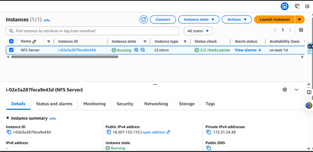

### Target Architecture

---
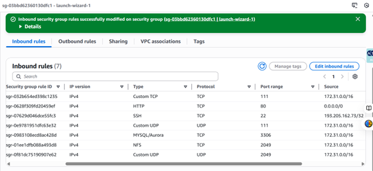
## Step 1: Provisioning the Load Balancer

I launched an Ubuntu 24.04 EC2 instance and named it `Project-8-apache-lb`.

1. **Installed Apache and dependencies**: I used `apt` to install `apache2` and enabled the necessary proxy modules.
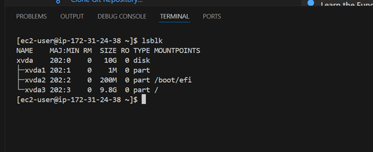
2. **Configured Security Groups**: I opened Port 80 to allow HTTP traffic.

### Load Balancer EC2 Instance Details
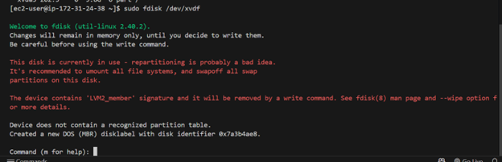
---

## Step 2: Configuring Load Balancing

I modified the Apache configuration file `/etc/apache2/sites-available/000-default.conf` to define the backend server cluster.

* **Balancing Method**: I chose `bytraffic` to distribute load based on data volume.
* **Backend Nodes**: I linked Web-Server-1 (`172.31.22.150`) and Web-Server-2 (`172.31.16.75`).
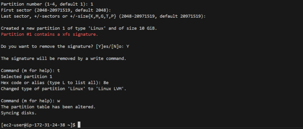
### Configuration File Content

---

## Step 3: Troubleshooting the Web Tier

This was the most intensive part of the project. I faced several "service dead" and "file not found" errors that required deep troubleshooting.
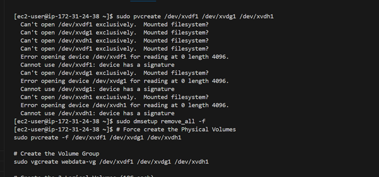
### Resolving the 203/EXEC Error

My Web Servers initially failed to start the `httpd` service.
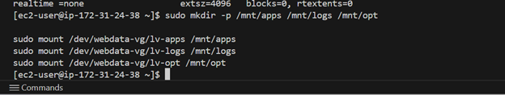
* **The Problem**: Corrupted binaries prevented execution.
* **The Fix**: I performed a clean wipe and reinstall of the Apache packages on RHEL.

### Mounting Centralized Storage

Once the services were healthy, I had to ensure the website files were accessible via NFS.
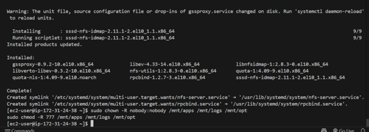
* **Command**: `sudo mount -t nfs -o rw,nosuid 172.31.24.38:/mnt/apps /var/www/html`

---
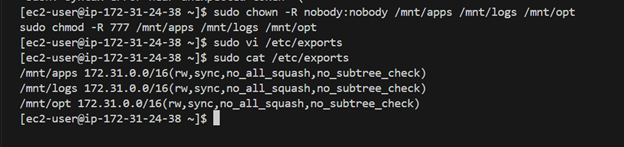

## Step 4: Final Verification

The project was successful once I could access the tooling website through the Load Balancer's Public IP.

1. **Live Website**: Verified the login page at `http://18.215.168.237/index.php`.
2. **Traffic Logs**: Observed traffic hitting both web servers by tailing the access logs.
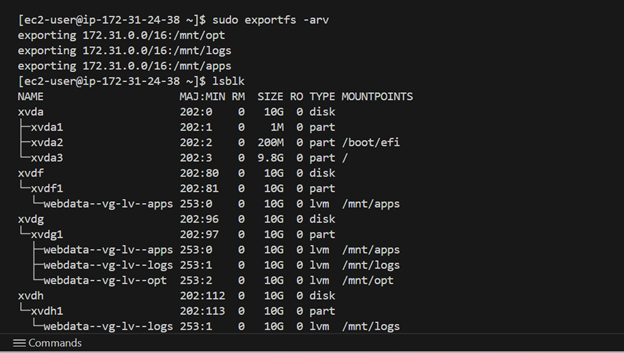
### Final Working Site & Logs

---
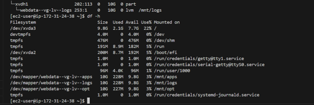
**Next Step**: If you have your screenshots saved in a folder in VS Code (e.g., an `images` folder), you can change the placeholders to ``. Would you like me to help you with the Git commands to push this to GitHub?
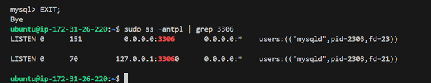
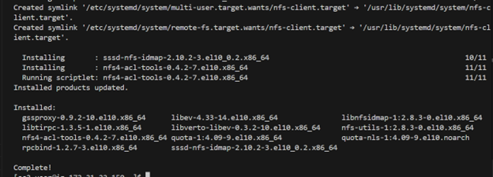
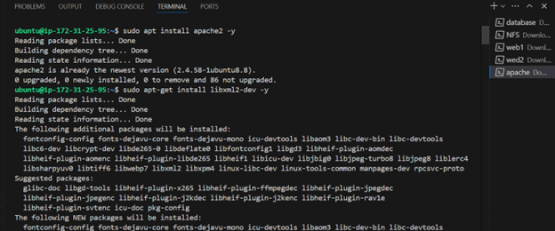
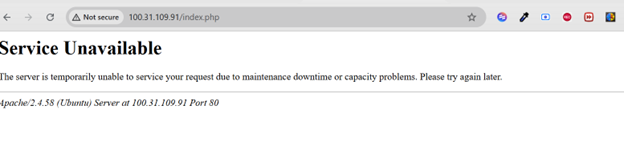