# 🚀 StegTechHub - High-Availability 3-Tier Web Application Deployment on AWS

This project documents the step-by-step process of deploying a highly available 3-tier web application using AWS EC2 instances, NFS for shared storage, and MySQL for the database backend. The application, "StegTechHub Tooling," is served by Apache on RHEL 10, ensuring scalability and redundancy.

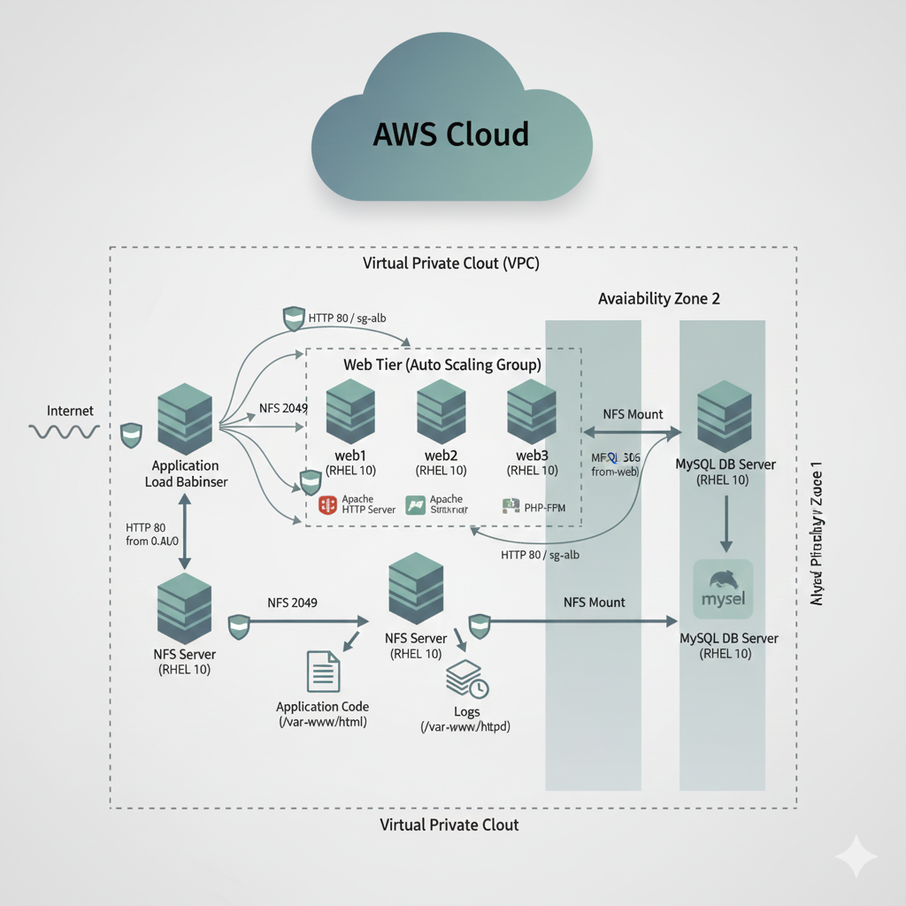

## Table of Contents

1. [Project Overview](https://www.google.com/search?q=%231-project-overview)
2. [Architecture Diagram](https://www.google.com/search?q=%232-architecture-diagram)
3. [AWS Infrastructure Setup](https://www.google.com/search?q=%233-aws-infrastructure-setup)
* [Launch EC2 Instances](https://www.google.com/search?q=%2331-launch-ec2-instances)
* [Security Group Configuration](https://www.google.com/search?q=%2332-security-group-configuration)


4. [MySQL Database Deployment](https://www.google.com/search?q=%234-mysql-database-deployment)
* [Installation and Configuration](https://www.google.com/search?q=%2341-installation-and-configuration)
* [Database User and Schema Setup](https://www.google.com/search?q=%2342-database-user-and-schema-setup)


5. [NFS Server for Shared Storage](https://www.google.com/search?q=%235-nfs-server-for-shared-storage)
* [Installation and Export Configuration](https://www.google.com/search?q=%2351-installation-and-export-configuration)
* [Client-Side Mounting](https://www.google.com/search?q=%2352-client-side-mounting)


6. [Web Server Setup (Apache & PHP)](https://www.google.com/search?q=%236-web-server-setup-apache--php)
* [Installation of Web Stack](https://www.google.com/search?q=%2361-installation-of-web-stack)
* [SELinux Configuration](https://www.google.com/search?q=%2362-selinux-configuration)


7. [Application Deployment](https://www.google.com/search?q=%237-application-deployment)
* [Forking and Cloning the Repository](https://www.google.com/search?q=%2371-forking-and-cloning-the-repository)
* [Deploying Files to Web Root](https://www.google.com/search?q=%2372-deploying-files-to-web-root)
* [Database Connection Configuration](https://www.google.com/search?q=%2373-database-connection-configuration)
* [Importing Application Schema](https://www.google.com/search?q=%2374-importing-application-schema)


8. [Load Balancer (AWS ALB) Configuration](https://www.google.com/search?q=%238-load-balancer-aws-alb-configuration)
9. [Final Verification and Troubleshooting](https://www.google.com/search?q=%239-final-verification-and-troubleshooting)

---

## 1. Project Overview

This project involved setting up a robust, scalable, and highly available web application environment on AWS. The key components include:

* **3 Web Servers (EC2 RHEL 10)**: Running Apache and PHP to serve the application.
* **1 NFS Server (EC2 RHEL 10)**: Centralized storage for application code (`/var/www/html`) and logs (`/var/log/httpd`), ensuring all web servers use the same files.
* **1 MySQL Database Server (EC2 RHEL 10)**: Dedicated backend for application data.
* **AWS Application Load Balancer (ALB)**: Distributes incoming traffic across the web servers for high availability and fault tolerance.

The goal was to provide a seamless user experience, even if one of the web servers encounters an issue.
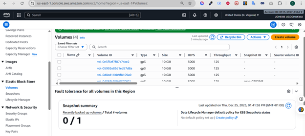

## 2. Architecture Diagram

Here is a visual representation of the deployed architecture:

---

## 3. AWS Infrastructure Setup

### 3.1 Launch EC2 Instances

I started by launching five EC2 instances, all running Red Hat Enterprise Linux 10 (`rhel-9-for-x86_64`):

* `web1` (t2.micro)
* `web2` (t2.micro)
* `web3` (t2.micro)
* `nfs-server` (t2.micro)
* `sql-project7` (t2.micro)

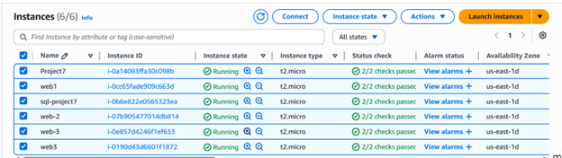

All instances were launched in the same VPC and Availability Zone to minimize latency.

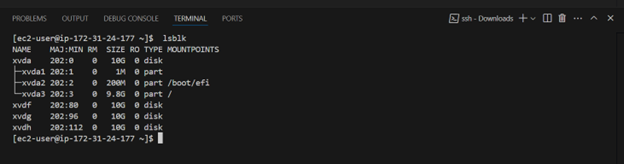

### 3.2 Security Group Configuration

I created and configured several Security Groups to ensure secure communication between the instances:

* **`sg-web`**:
* Inbound: HTTP (Port 80) from Anywhere (for Load Balancer and initial access), SSH (Port 22) from My IP.
* Outbound: All traffic.

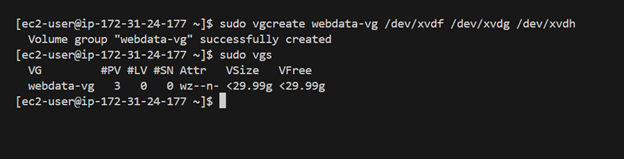

* **`sg-nfs`**:
* Inbound: NFS (Port 2049) from `sg-web` (allowing web servers to connect), SSH (Port 22) from My IP.
* Outbound: All traffic.


* **`sg-db`**:
* Inbound: MySQL/Aurora (Port 3306) from `sg-web` (allowing web servers to connect), SSH (Port 22) from My IP.
* Outbound: All traffic.


`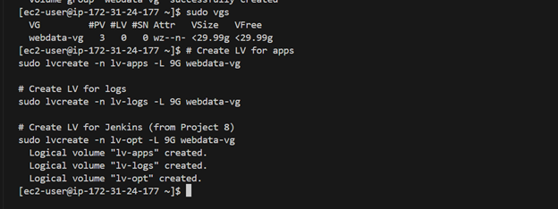

---

## 4. MySQL Database Deployment

### 4.1 Installation and Configuration

On the `sql-project7` instance, I installed MySQL Server and configured it.
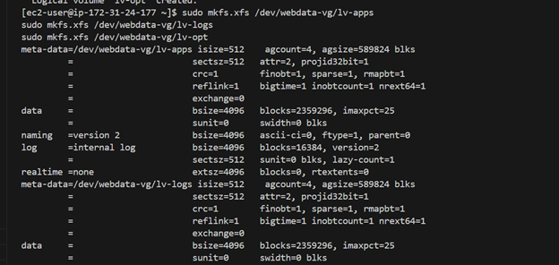

```bash
sudo dnf update -y
sudo dnf install mysql-server -y
sudo systemctl start mysqld
sudo systemctl enable mysqld
sudo mysql_secure_installation # Configured root password, removed anonymous users, etc.

```

``

### 4.2 Database User and Schema Setup

I created a dedicated database (`tooling`) and a user (`admin` with password `admin`) with specific permissions for the web application.
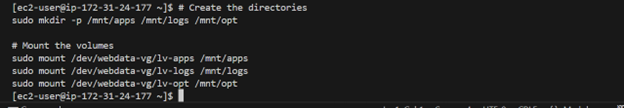

```sql
# Log into MySQL as root
sudo mysql

# Create the database
CREATE DATABASE tooling;

# Create user and grant privileges
CREATE USER 'admin'@'%' IDENTIFIED BY 'admin';
GRANT ALL PRIVILEGES ON tooling.* TO 'admin'@'%';
FLUSH PRIVILEGES;

# Exit MySQL
EXIT;

```

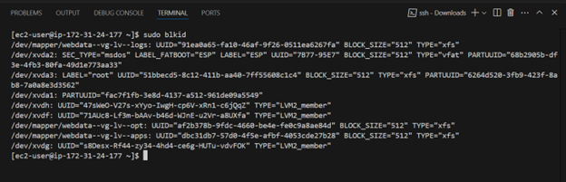

---

## 5. NFS Server for Shared Storage

### 5.1 Installation and Export Configuration

On the `nfs-server` instance, I installed NFS utilities and configured the directories to be shared.

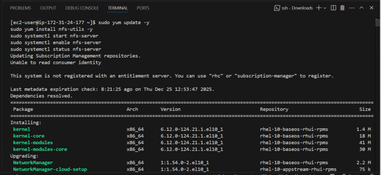
```bash
sudo dnf update -y
sudo dnf install nfs-utils -y

# Create shared directories
sudo mkdir -p /mnt/alx/html
sudo mkdir -p /mnt/alx/logs

# Set permissions
sudo chown -R nobody:nobody /mnt/alx/html
sudo chown -R nobody:nobody /mnt/alx/logs
sudo chmod -R 777 /mnt/alx/html
sudo chmod -R 777 /mnt/alx/logs

# Configure exports (edit /etc/exports)
# /mnt/alx/html 172.31.0.0/20(rw,sync,no_root_squash,no_all_squash,anonuid=nobody,anongid=nobody)
# /mnt/alx/logs 172.31.0.0/20(rw,sync,no_root_squash,no_all_squash,anonuid=nobody,anongid=nobody)

# Apply exports and start NFS
sudo exportfs -arv
sudo systemctl start nfs-server
sudo systemctl enable nfs-server
sudo systemctl restart nfs-server

```

*(Note: `172.31.0.0/20` should be replaced with your VPC's CIDR block to allow all instances in the VPC to connect.)*


### 5.2 Client-Side Mounting

On each of the `web1`, `web2`, and `web3` instances, I installed NFS utilities and mounted the shared directories.

```bash
sudo dnf update -y
sudo dnf install nfs-utils -y

# Create mount points
sudo mkdir -p /var/www/html
sudo mkdir -p /var/log/httpd

# Mount NFS shares (replace NFS_SERVER_PRIVATE_IP with your NFS server's private IP)
sudo mount -t nfs NFS_SERVER_PRIVATE_IP:/mnt/alx/html /var/www/html
sudo mount -t nfs NFS_SERVER_PRIVATE_IP:/mnt/alx/logs /var/log/httpd

# Make mounts persistent (edit /etc/fstab)
# NFS_SERVER_PRIVATE_IP:/mnt/alx/html /var/www/html nfs defaults,_netdev 0 0
# NFS_SERVER_PRIVATE_IP:/mnt/alx/logs /var/log/httpd nfs defaults,_netdev 0 0

# Reload systemd to apply fstab changes
sudo systemctl daemon-reload

```

`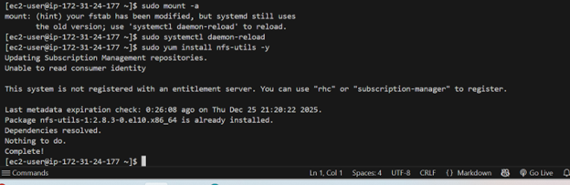

---

## 6. Web Server Setup (Apache & PHP)

On each of the `web1`, `web2`, and `web3` instances, I installed the necessary web server components.

### 6.1 Installation of Web Stack
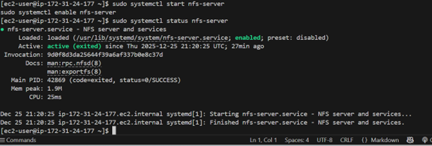
```bash
sudo dnf update -y
sudo dnf install httpd php php-mysqlnd php-fpm git mariadb -y
sudo systemctl start httpd
sudo systemctl enable httpd
sudo systemctl start php-fpm
sudo systemctl enable php-fpm

```

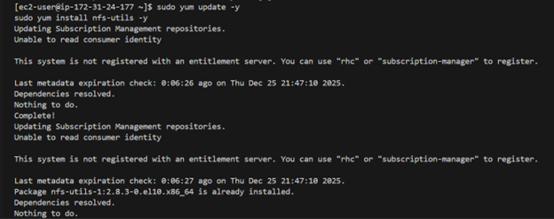

### 6.2 SELinux Configuration

SELinux on RHEL is very strict. I configured it to allow Apache to serve content from NFS and connect to the database.
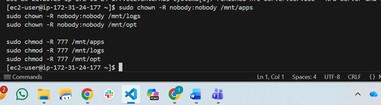
```bash
# Allow Apache to serve content from NFS mounts
sudo setsebool -P httpd_use_nfs 1

# Allow Apache to connect to a network database
sudo setsebool -P httpd_can_network_connect_db 1

# If needed for general network connections
sudo setsebool -P httpd_can_network_connect 1

# Ensure correct context for initial setup (though NFS does not apply per-file labels)
# sudo chcon -t httpd_sys_content_t /var/www/html -R # This will fail on NFS, use httpd_use_nfs instead

```

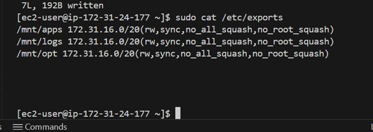

---

## 7. Application Deployment

### 7.1 Forking and Cloning the Repository

I forked the application repository (`https://github.com/darey-io/tooling`) to my GitHub account (`https://github.com/dugospace/tooling-steghub.git`). Then, on one of the web servers (e.g., `web3`), I cloned it. Due to NFS, this automatically made the code available on all web servers.

```bash
git clone https://github.com/dugospace/tooling-steghub.git
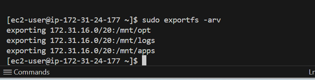
```


### 7.2 Deploying Files to Web Root

I copied the application files from the cloned repository into the Apache web root, which is mounted via NFS.
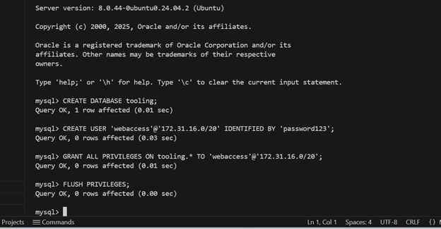

```bash
sudo cp -R tooling-steghub/html/* /var/www/html/

```

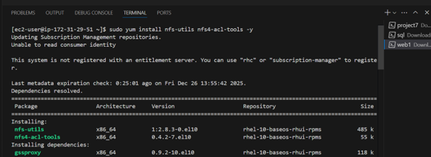

### 7.3 Database Connection Configuration

I updated the `functions.php` file on one of the web servers to point to the correct database IP and credentials. This change was instantly reflected across all web servers due to NFS.

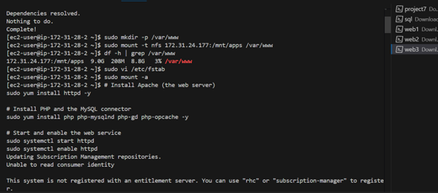

```bash
sudo vi /var/www/html/functions.php
# (Updated line: $db = mysqli_connect('YOUR_DB_PRIVATE_IP', 'admin', 'admin', 'tooling'); )

```

*(My DB private IP was 172.31.30.82)*

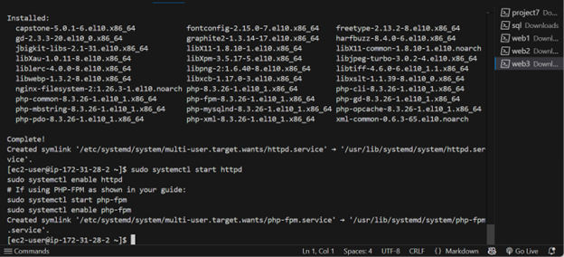

### 7.4 Importing Application Schema

I used the `mysql` client (installed as `mariadb-client` on RHEL 10) on one web server to import the application's SQL schema into the remote MySQL database.

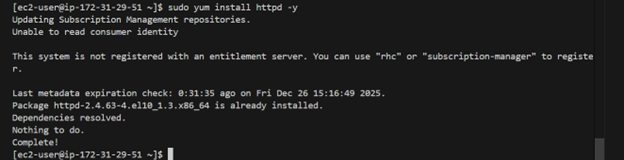

```bash
sudo dnf install mariadb -y # If not already installed
mysql -h YOUR_DB_PRIVATE_IP -u admin -p tooling < /home/ec2-user/tooling-steghub/tooling-db.sql
# (Enter 'admin' as password when prompted)

```

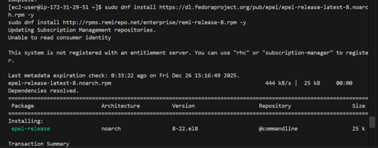

---

## 8. Load Balancer (AWS ALB) Configuration

To achieve true high-availability and provide a single access point, I configured an AWS Application Load Balancer.

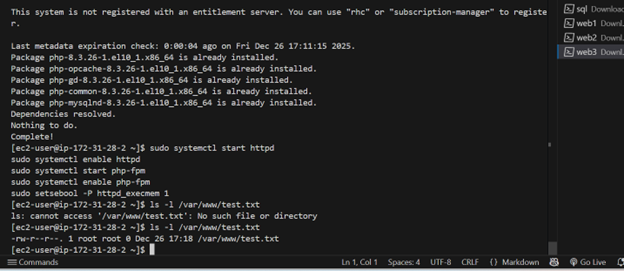

1. **Created a Target Group (`tooling-web-servers`)**: Registered `web1`, `web2`, and `web3` as targets, with HTTP health checks to `/login.php`.
2. **Created an Application Load Balancer**: Configured it as Internet-facing, selected VPC and subnets, and attached a security group allowing HTTP (Port 80) from anywhere. The listener was configured to forward traffic to the `tooling-web-servers` Target Group.

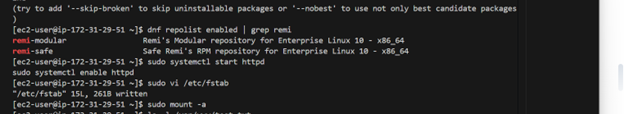

3. **Updated Web Server Security Groups**: Modified the security groups of `web1`, `web2`, and `web3` to only allow HTTP traffic from the Load Balancer's security group, enhancing security.

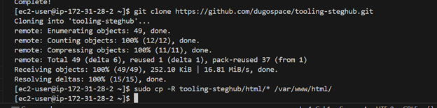

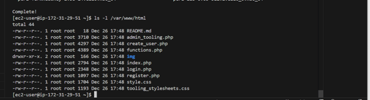


---

## 9. Final Verification and Troubleshooting

After all steps, I accessed the application via the ALB's DNS name (or directly via any web server's Public IP).

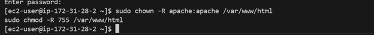

I successfully logged in using `admin` / `admin`.

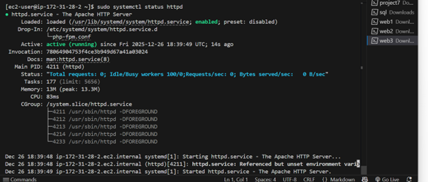

**Troubleshooting Notes:**

* **"Forbidden" Error**: This was resolved by properly configuring SELinux to allow `httpd` to use NFS mounts (`sudo setsebool -P httpd_use_nfs 1`).
* **Apache Service Failure**: Often due to incorrect permissions on `/var/log/httpd` after NFS mounting. Resolved by `sudo chown -R apache:apache /var/log/httpd` and `sudo systemctl restart httpd`.

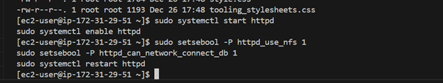

* **`mysql: command not found`**: Resolved by installing `mariadb` client on the web servers (`sudo dnf install mariadb -y`).

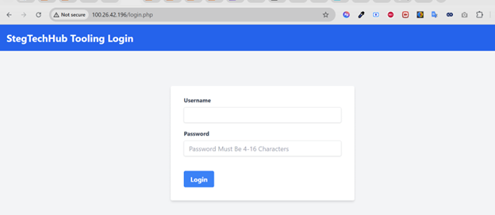

* **"Access denied"**: Resolved by correctly granting permissions to the `admin` user from any host (`%`) on the `tooling` database within the MySQL server.

This concludes the deployment of the highly available 3-tier web application.

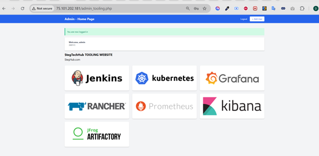
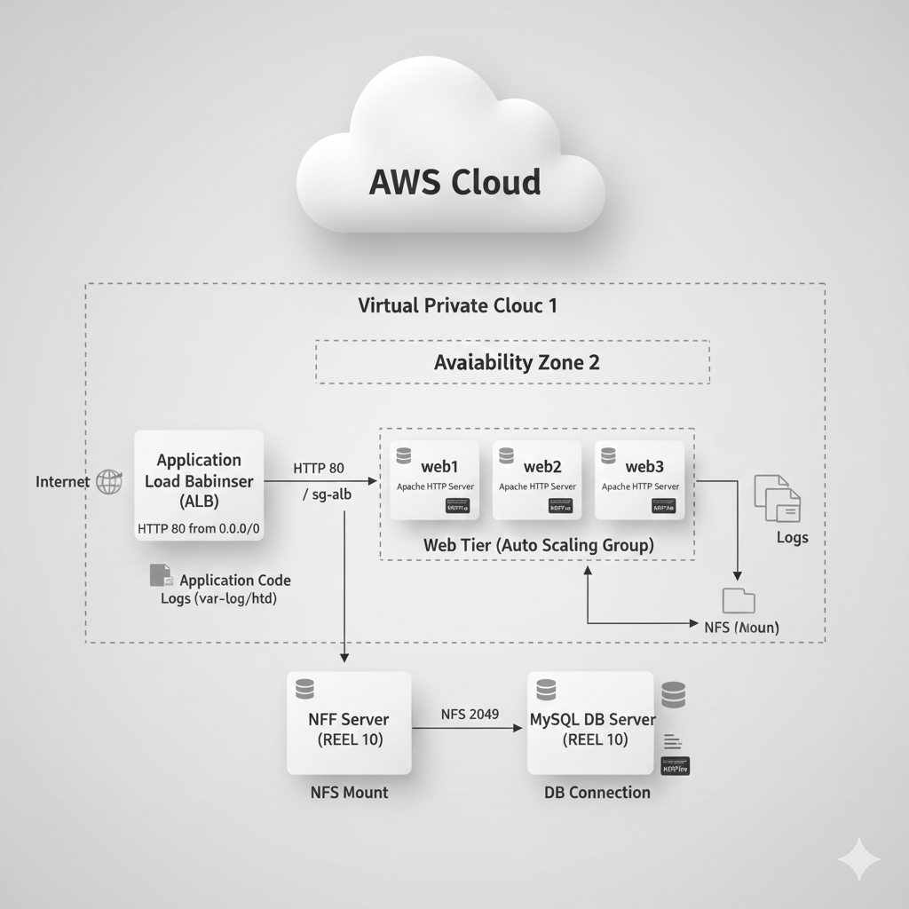
