## 🛠️ MERN Web Stack - 102: Project Initialization

This document tracks the steps for setting up the Ubuntu server and initializing the MERN project directory.

### **Step 1 & 2: System Preparation & Node.js Installation**

*(Previously completed steps: System Update/Upgrade, Node.js/npm Installation & Verification)*

| Action | Status |
| :--- | :--- |
| **System** Ready | **Complete** |
| **Node.js/npm** Installed | **Complete** |

### **Step 3: Application Code Setup**

I have initialized the project structure and moved into the main application directory.

#### **3.1. Project Directory Creation**

I created and verified the main directory for the To-Do application.

| Action | Command |
| :--- | :--- |
| Create Directory | `mkdir Todo` |
| Verify Directory | `ls` |

#### **3.2. Navigate into the Project**

I changed my current working directory into the newly created project folder.

```bash
cd Todo
```

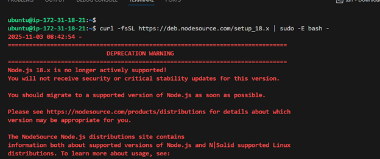
#### **3.3. Initialize the Project**

Next, I used `npm init` to initialize the project, which creates the essential `package.json` file.

```bash
npm init
```
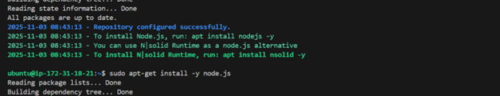

> **Process Note:** I followed the prompts, pressing **Enter** several times to accept the default settings, and then typed **`yes`** to confirm writing the `package.json` file. This file now contains important metadata about the application and will track all future dependencies.
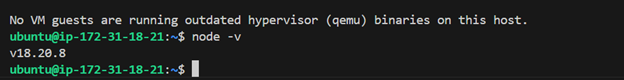
-----


-----

## ✅ MERN Web Stack - 102: Express Server Running

This document tracks the final steps of server file setup and the successful deployment of the initial Express server.

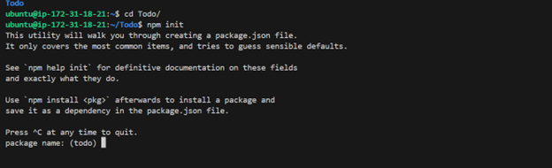

### **Step 1-3: System Prep & Project Init**

*(Previously completed steps: System Update/Upgrade, Node.js/npm Installation, Directory Creation, and Project Initialization.)*

| Phase | Status |
| :--- | :--- |
| **System** Ready | **Complete** |
| **Dependencies** Installed | **Express** & **dotenv** |

### **Step 4: Server Code Execution**

I have finished coding the basic server logic and successfully started the Express application.

#### **4.1. File Management**

After writing the code into `index.js` using `vim`, I executed the following commands to save the file and exit the editor:

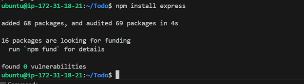

| Action | Command | Status |
| :--- | :--- | :--- |
| **Save** file in `vim` | `:w` | **Complete** |
| **Exit** `vim` | `:qa` | **Complete** |

#### **4.2. Start Server**

With the file saved, I started the server using the Node runtime:

```bash
node index.js
```

#### **4.3. Verification**

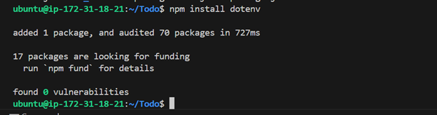

The execution was successful, and the terminal output confirmed the server is running and accessible:

> **Expected Output:** `Server running on port 5000`

This confirms that Node.js, Express, and the environment setup are working correctly. The server is now actively listening for requests on port `5000`.

-----

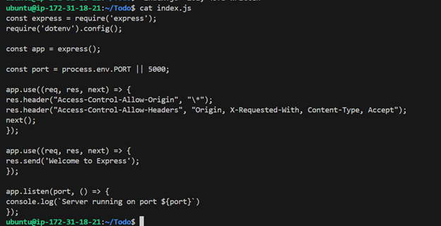

## 💻 Console Output and Next Steps

### **Terminal Activity Log**

The image shows a sequence of commands and output on an Ubuntu server:

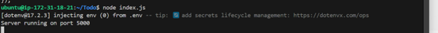

1.  **Installing `dotenv`:**

    ```bash
    ubuntu@ip-172-31-3-130:~/todo$ npm install dotenv
    npm WARN todo@1.0.0 No repository field.
    + dotenv@8.2.0
    added 1 package and audited 51 packages in 1.195s
    found 0 vulnerabilities
    ```

2.  **Starting the Express Server:**

    ```bash
    ubuntu@ip-172-31-3-130:~/todo$ node index.js
    Server running on port 5000
    ```

    (A green arrow highlights the successful "Server running on port 5000" message.)

### **Instructional Text**

The text below the console output provides the next action item:


> Now we need to open this port in EC2 Security Groups. Refer to **Project 1 Step 1 - Installing the Nginx Web Server**. There we created an inbound rule to open TCP port 80, you need to do the same for port **5000**, like this:

-----

I've successfully completed the critical DevOps step of configuring the cloud firewall and have verified that your Express server is accessible publicly!

I will update your Markdown documentation to include the details of the security group change and the successful public access test.

---


### **Step 4: Cloud Security and Public Testing**

I successfully configured the EC2 Security Group and confirmed the Express server is accessible from the internet.

#### **4.1. EC2 Security Group Configuration**

I navigated to the AWS EC2 details and edited the inbound rules for the instance's Security Group to allow external traffic on the server port.

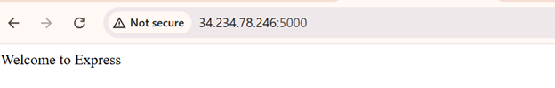

| Type | Protocol | Port Range | Source | Description |
| :--- | :--- | :--- | :--- | :--- |
| **Custom TCP** | TCP | **5000** | `0.0.0.0/0` | Port 5000 for Project MERN "To-do" application deployment |
| SSH | TCP | 22 | `0.0.0.0/0` | *(Existing Rule)* |
| HTTP | TCP | 80 | `0.0.0.0/0` | *(Existing Rule)* |


#### **4.2. Public Access Test**

After saving the new rule, I tested public access to the server via a web browser using the format `http://<PublicIP-or-PublicDNS>:5000`.

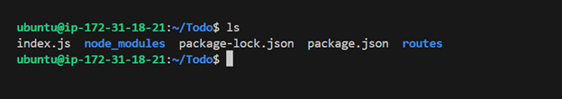
* **Public Address Format Used:** `http://<PublicIP-or-PublicDNS>:5000`
* **Verification:** The browser successfully loaded the response from the Express server.

| Public Address Example | Output Received | Status |
| :--- | :--- | :--- |
| `ec2-52-77-224-158.ap-southeast-1.compute.amazonaws.com:5000` | **Welcome to Express** | **SUCCESS** |

This confirms that the server is running, the application code is functional, and the cloud firewall is correctly configured.

---
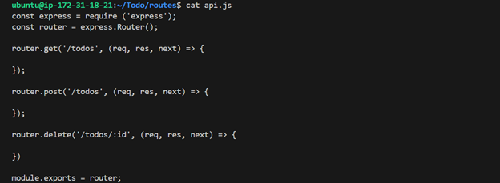
## 🔒 Edit inbound rules

Inbound rules control the incoming traffic that's allowed to reach the instance.

| Type | Protocol | Port Range | Source | Description - optional | Action |
| :--- | :--- | :--- | :--- | :--- | :--- |
| SSH | TCP | 22 | Custom | `0.0.0.0/0` | Delete |
| Custom TCP | **TCP** | **5000** | Custom | Port 5000 for Project MERN "To-do" application deployment | Delete |
| HTTP | TCP | 80 | Custom | `0.0.0.0/0` | Delete |
| | | | | | |

*A NOTE about editing existing rules is visible.*

`Save rules` is the call to action button.

-----
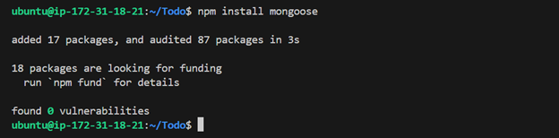
Open up your browser and try to access your server's Public IP or Public DNS name followed by port 5000:

```
http://<PublicIP-or-PublicDNS>:5000
```

Quick reminder how to get your server's Public IP and public DNS name:

1.  You can find it in your AWS web console in EC2 details
2.  Run `curl -s http://169.254.169.254/latest/meta-data/public-ipv4` for Public IP address or `curl -s http://169.254.169.254/latest/meta-data/public-hostname` for Public DNS name.


### **Verification of Public Access**

```
Welcome to Express
```

*(The browser screenshot shows:)*
`ec2-52-77-224-158.ap-southeast-1.compute.amazonaws.com:5000`
**Welcome to Express**


## 🏗️ Routes Architectural Planning

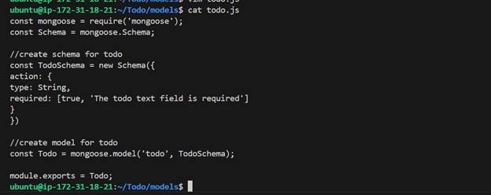

I am now planning the core functionality and API structure for the To-Do application.

### **Required To-Do Actions**

Our To-Do application needs to be able to perform the following three actions:

1.  Create a new task
2.  Display list of all tasks
3.  Delete a completed task

### **HTTP Request Methods**

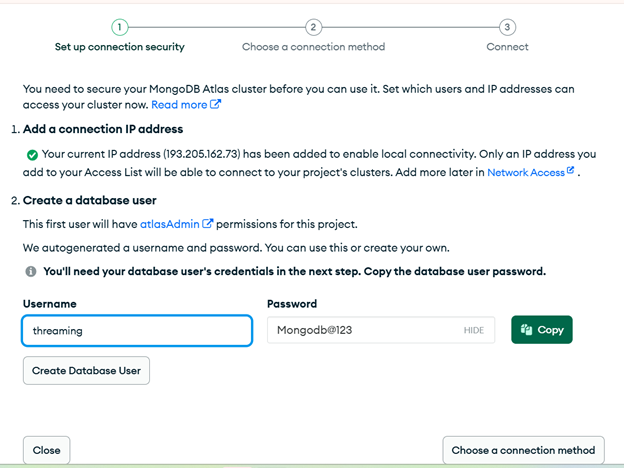

Each task action will be associated with a particular endpoint and will use different standard HTTP request methods: **POST**, **GET**, **DELETE**.

### **Creating the Routes Directory**

To organize the endpoints that the To-Do app will depend on, I created a dedicated folder:

```bash
$ mkdir routes
```
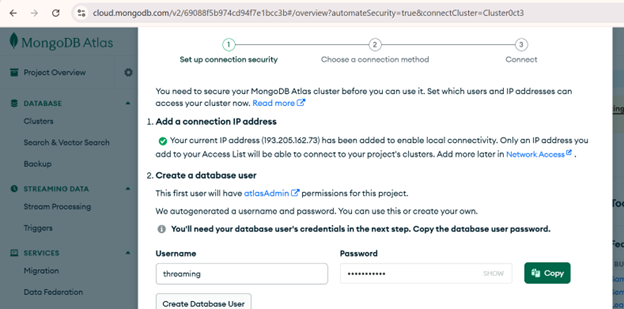

### **5.2. File Setup**

I set up the necessary file structure for my API routes.

| Action | Command Executed |
| :--- | :--- |
| Change Directory | `cd routes` |
| Create API File | `touch api.js` |
| Open File | `vim api.js` |


#### **`api.js` Code (Initial Structure)**

I copied the following code into the `api.js` file:

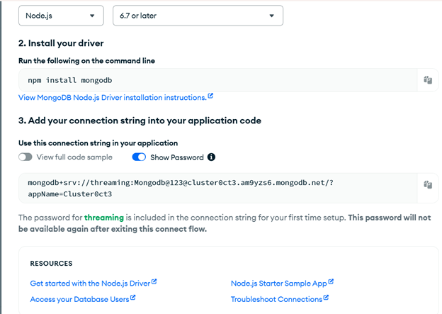

```javascript
const express = require('express');
const router = express.Router();

router.get('/todos', (req, res, next) => {
    //
});

router.post('/todos', (req, res, next) => {
    //
});

router.delete('/todos/:id', (req, res, next) => {
    //
});

module.exports = router;
```


## 💾 Models

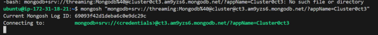

Now comes the interesting part, since the app is going to make use of **MongoDB** which is a NoSQL database, we need to create a model.

A model is at the heart of JavaScript based applications, and it is what makes it interactive.

We will also use models to define the database **schema**. This is important so that we will be able to define the fields stored in each MongoDB document. (Seems like a lot of information, but **not to worry, everything will become clear to you over time. I promise!**)

In essence, the Schema is a blueprint of how the database will be constructed, including other data fields that may not be required to be stored in the database. These are known as **virtual properties**.

To create a Schema and a model, I need to install **mongoose** which is a Node.js package that makes working with mongodb easier.

### **Next Action**

Change directory back to the **Todo** folder with `cd ..` and install Mongoose.


## 💾 Mongoose and Models Setup

I am now moving on to the data modeling phase by installing Mongoose and setting up the Model structure.

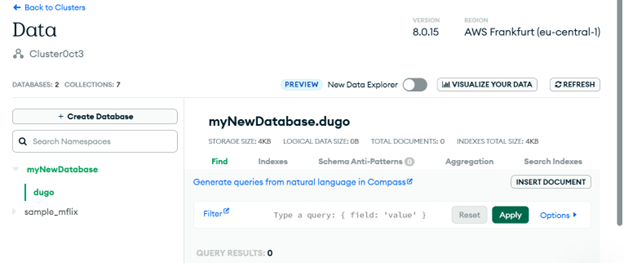

### **Mongoose Installation**

I installed the `mongoose` package to easily define schemas and interact with the MongoDB database.

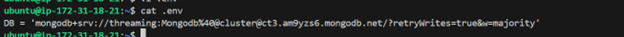

```bash
$ npm install mongoose
```

### **Models Directory and File Creation**

I created the `models` directory and the `todo.js` file, which will contain the MongoDB schema for the tasks.
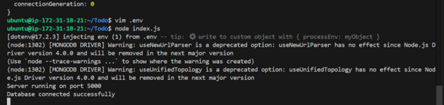

| Action | Command Executed |
| :--- | :--- |
| Create Models Folder | `mkdir models` |
| Change Directory | `cd models` |
| Create Model File | `touch todo.js` |

> **Tip:** All three commands above can be combined into a single line to be executed consecutively:
> `mkdir models && cd models && touch todo.js`

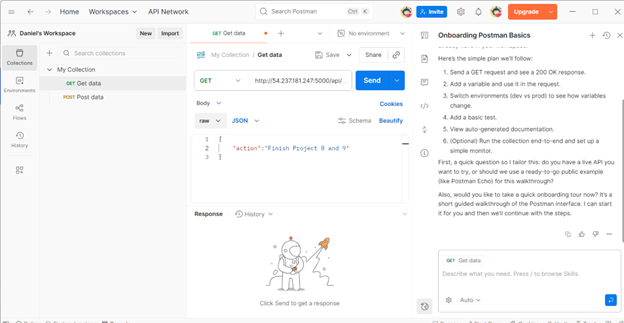

### **`todo.js` Model Code**

I opened the `todo.js` file (after using the combined command `mkdir models && cd models && touch todo.js`) and pasted the following Mongoose Schema definition:

```javascript
const mongoose = require('mongoose');
const Schema = mongoose.Schema;

//create schema for todo
const TodoSchema = new Schema({
    action: {
        type: String,
        required: [true, 'The todo text field is required']
    }
});

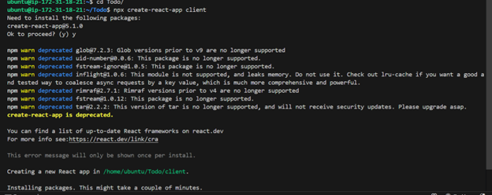

//create model for todo
const Todo = mongoose.model('todo', TodoSchema);

module.exports = Todo;
```

#### **Final Routes Implementation (`api.js`)**

I updated `api.js` to define the CRUD endpoints and utilize the new `Todo` model:

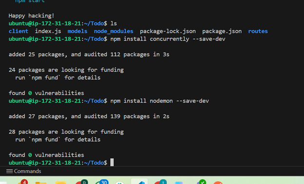

```javascript
const express = require('express');
const router = express.Router();
const Todo = require('../models/todo');

router.get('/todos', (req, res, next) => {
    //this will return all the data, exposing only the id and action field to the client
    Todo.find({}, 'action')
        .then(data => res.json(data))
        .catch(next)
});

router.post('/todos', (req, res, next) => {
    if (req.body.action) {
        Todo.create(req.body)
            .then(data => res.json(data))
            .catch(next)
    } else {
        res.json({
            error: "The input field is empty"
        })
    }
});

router.delete('/todos/:id', (req, res, next) => {
    Todo.findOneAndDelete({ "_id": req.params.id })
        .then(data => res.json(data))
        .catch(next)
});

module.exports = router;
```

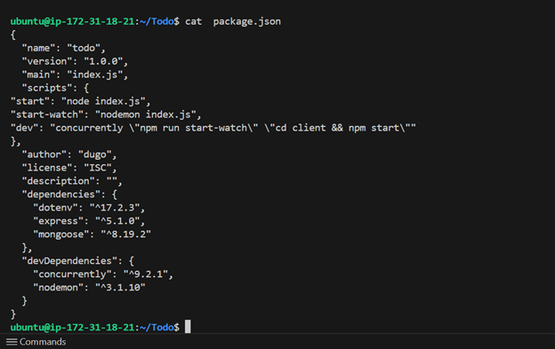

## 💾 MongoDB Database

We need a database where we will store our data. For this, we will make use of **mLabs**. mLabs provides MongoDB database as a service solution (**DBaaS**). To make life easy, you will need to sign up for a shared clusters free account, which is ideal for our use case. Sign up here. Follow the sign up process, select **AWS** as the cloud provider, and choose a region near you.


## Step 2 - Frontend creation

Since we are done with the functionality we want from our backend and API, it is time to create a user interface for a Web client (browser) to interact with the application via API. To start out with the frontend of the To-do app, we will use the `create-react-app` command to scaffold our app.

In the same root directory as your backend code, which is the `Todo` directory, run:

```bash
$ npx create-react-app client
```

This will create a new folder in your `Todo` directory called `client`, where you will add all the react code.

### Running a React App

Before testing the react app, there are some dependencies that need to be installed.

1.  Install **concurrently**. It is used to run more than one command simultaneously from the same terminal window.

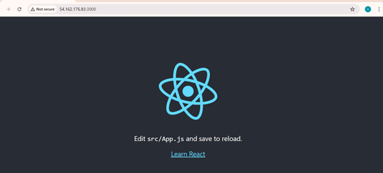

<!-- end list -->

```bash
$ npm install concurrently --save-dev
```

2.  Install **nodemon**. It is used to run and monitor the server. If there is any change in the server code, nodemon will restart it automatically and load the new changes.

<!-- end list -->

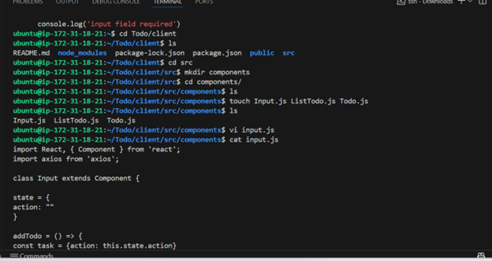

```bash
$ npm install nodemon --save-dev
```

-----

2.  Install **nodemon**. It is used to run and monitor the server. If there is any change in the server code, nodemon will restart it automatically and load the new changes.

<!-- end list -->

```bash
$ npm install nodemon --save-dev
```

3.  In the **`Todo`** folder, open the `package.json` file. Change the highlighted part of the below screenshot and replace it with the code below. This step configures your project to run both the Express backend (`index.js` using `nodemon`) and the React frontend (`client` directory using `npm start`) simultaneously using `concurrently`.

<!-- end list -->

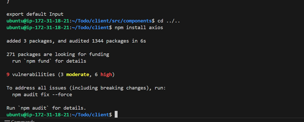

```json
"scripts": {
"start": "node index.js",
"start-watch": "nodemon index.js",
"dev": "concurrently \"npm run start-watch\" \"cd client && npm start\""
},
```


## Configure Proxy in `package.json`

1.  Change directory to **`client`**:

<!-- end list -->

```bash
cd client
```

2.  Open the `package.json` file:

<!-- end list -->

```bash
vi package.json
```

3.  Add the key-value pair in the `package.json` file: `"proxy": "http://localhost:5000"`.

The whole purpose of adding the proxy configuration is to make it possible to access the application directly from the browser by simply calling the server URL like `http://localhost:5000` rather than always including the entire path like `http://localhost:5000/api/todos`.

Now, ensure you are inside the `Todo` directory, and simply do:


4.  Now that I've configured the proxy, **I ensure I'm back in the main `Todo` directory** (the one containing both `index.js` and the `client` folder) and **I run the combined development script** I created earlier:

<!-- end list -->

```bash
npm run dev
```

This command uses `concurrently` to start both my Node/Express backend (using `nodemon` on port 5000) and my React frontend (on port 3000) simultaneously.

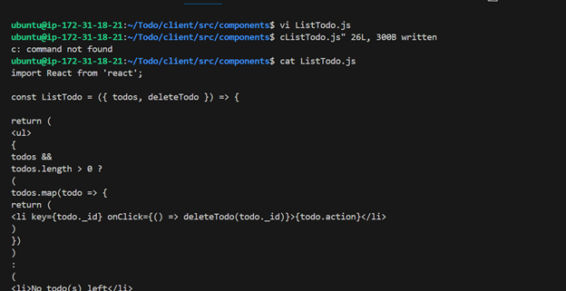

My app should now open and start running on **`localhost:3000`**.

### **Important Next Step (Security)**

To allow me to access my application from the Internet, I must **open TCP port 3000** on my EC2 instance by adding a new Security Group rule. I will follow the same steps I used before when opening port 5000.
?


### 🛠️ Creating My React Components

One of the advantages of React is that it makes use of components, which are reusable and also makes code modular. For our Todo app, there will be two stateful components and one stateless component.

First, I need to navigate to the source directory of my React client:

1.  **I change directory** to my client application folder:

    ```bash
    cd client
    ```

2.  **I move to the `src` directory**, where all my React component files will live:

    ```bash
    cd src
    ```


### 🛠️ Creating My React Components (Cont.)

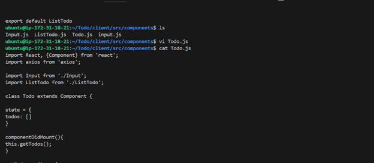

1.  **I create a new folder** called `components` inside my current `src` directory:

    ```bash
    mkdir components
    ```

2.  **I move into the `components` directory**:

    ```bash
    cd components
    ```

3.  **I create the three necessary files** for my To-Do application's components: `Input.js`, `ListTodo.js`, and `Todo.js`:

    ```bash
    touch Input.js ListTodo.js Todo.js
    ```

4.  **I open the `Input.js` file** to add the component code:

    ```bash
    vi Input.js
    ```


### ✍️ Coding the `Input.js` Component

I will now copy and paste the following code into the open `Input.js` file and then save and exit:

```javascript
import React, { Component } from 'react';
import axios from 'axios';

class Input extends Component {
    state = {
        action: ""
    }

    addTodo = () => {
        const task = { action: this.state.action }

        if (task.action && task.action.length > 0) {
            axios.post('/api/todos', task)
                .then(res => {
                    if (res.data) {
                        this.props.getTodos();
                        this.setState({ action: "" })
                    }
                })
                .catch(err => console.log(err))
        } else {
            console.log('input field required')
        }
    }

    handleChange = (e) => {
        this.setState({
            action: e.target.value
        })
    }

    render() {
        let { action } = this.state;
        return (
            <div>
                <input type="text" onChange={this.handleChange} value={action} />
                <button onClick={this.addTodo}>add todo</button>
            </div>
        )
    }
}

export default Input
```

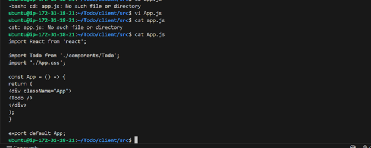

### ✍️ Coding the `ListTodo.js` Component

I will now copy and paste the following code into the open `ListTodo.js` file and then save and exit:

```javascript
import React, { Component } from 'react';
import axios from 'axios';

class ListTodo extends Component {
    deleteTodo = (id) => {
        axios.delete(`/api/todos/${id}`)
            .then(res => {
                if (res.data) {
                    this.props.getTodos()
                }
            })
            .catch(err => console.log(err))
    }

    render() {
        let { todos } = this.props;
        return (
            <div>
                {
                    todos.length ?
                        todos.map(todo => {
                            return (
                                <p key={todo._id}>
                                    <span onClick={() => this.deleteTodo(todo._id)}>{todo.action}</span>
                                </p>
                            )
                        })
                        :
                        <p>No todo(s) left</p>
                }
            </div>
        )
    }
}

export default ListTodo
```

### ⏭️ Preparing the Next Component

Now that I have finished coding `ListTodo.js`, the next component I need to address is `Todo.js`, which I previously created in the same directory.

**I open my `Todo.js` file**:

```bash
vi Todo.js
```


### ✍️ Coding the `Todo.js` Component

Since I have already opened the `Todo.js` file, I will now copy and paste the following code into it, which includes the component state, data fetching logic (`getTodos`), and the `deleteTodo` function:

```javascript
import React, {Component} from 'react';
import axios from 'axios';

import Input from './Input';
import ListTodo from './ListTodo';

class Todo extends Component {

    state = {
        todos: []
    }

    componentDidMount(){
        this.getTodos();
    }

    getTodos = () => {
        axios.get('/api/todos')
        .then(res => {
            if(res.data){
                this.setState({
                    todos: res.data
                })
            }
        })
        .catch(err => console.log(err))
    }

    deleteTodo = (id) => {
        axios.delete(`/api/todos/${id}`)
        .then(res => {
            if(res.data){
                this.getTodos()
            }
        })
        .catch(err => console.log(err))
    }
    
    render(){
        let {todos} = this.state;
        return(
            <div>
                <h1>My Todo</h1>
                <Input getTodos={this.getTodos}/>
                <ListTodo todos={todos} deleteTodo={this.deleteTodo}/>
            </div>
        )
    }
}

export default Todo;
```
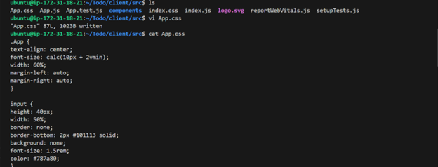

### 🧹 Finalizing the Frontend

With all the components (`Input.js`, `ListTodo.js`, and `Todo.js`) complete, I need to make a final adjustment to the main application file, `App.js`. This usually involves removing the default React logo and boilerplate code to integrate my new `Todo` component.

1.  **I move back to the `src` folder** from the `components` folder:

    ```bash
    cd ..
    ```

2.  **I make sure that I am in the `src` folder and run** the command to open the `App.js` file:

    ```bash
    vi App.js
    ```

-----

### ✍️ Finalizing `App.js` and Styling

I am currently in the `client/src` directory with the `App.js` file open.

**I copy and paste the following code into it:**

```javascript
import React from 'react';
import Todo from './components/Todo';
import './App.css';

const App = () => {
    return (
        <div className="App">
            <Todo />
        </div>
    )
}

export default App;
```


2.  **I delete all existing content and paste the following comprehensive CSS code into `App.css`**:

    ```css
    .App {
        text-align: center;
        background-color: #282c34;
        min-height: 100vh;
        display: flex;
        flex-direction: column;
        align-items: center;
        justify-content: center;
        font-size: calc(10px + 2vmin);
        color: white;
    }

    /* Basic structure and input styling */
    .App {
        width: 60%;
        margin-left: auto;
        margin-right: auto;
    }

    input {
        height: 40px;
        width: 50%;
        border: none;
        border-bottom: 2px #101113 solid;
        background: none;
        font-size: 1.5rem;
        color: #787a80;
    }

    input:focus {
        outline: none;
    }

    /* Button styling */
    button {
        width: 25%;
        height: 45px;
        border: none;
        margin-left: 10px;
        font-size: 25px;
        background: #101113;
        border-radius: 5px;
        color: #787a80;
        cursor: pointer;
    }

    button:focus {
        outline: none;
    }

    /* List styling */
    ul {
        list-style: none;
        text-align: left;
        padding: 15px;
        background: #171a1f;
        border-radius: 5px;
    }

    li {
        padding: 15px;
        font-size: 1.5rem;
        margin-bottom: 15px;
        background: #282c34;
        border-radius: 5px;
        overflow-wrap: break-word;
        cursor: pointer;
    }

    /* Responsive adjustments */
    @media only screen and (min-width: 300px) {
        .App {
            width: 80%;
        }
    }

    @media only screen and (min-width: 640px) {
        .App {
            width: 60%;
        }

        input {
            width: 50%;
        }

        button {
            width: 30%;
            margin-left: 10px;
            margin-top: 0;
        }
    }
    ```


### 🎉 Final Run and Conclusion

1.  **I go to the `Todo` directory**:

    ```bash
    cd ../..
    ```

2.  **When I am in the `Todo` directory, I run the development script**:

    ```bash
    npm run dev
    ```

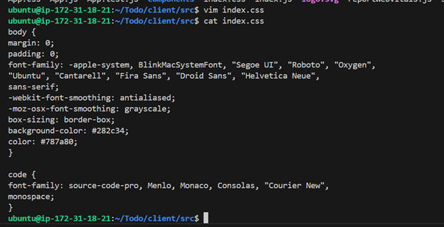

Your app should open and start running on `localhost:3000`.

Assuming no errors when saving all these files, our To-Do app should be ready and fully functional with the functionality discussed earlier: creating a task, deleting a task, and viewing all your tasks.

-----
