# 🌐 My Web Solution With WordPress Project

I am progressing in practicing to implement web solutions using different technologies. As a DevOps engineer, I will most probably encounter **PHP-based solutions** since, even in 2021, it is the dominant web programming language used by more websites than any other programming language.

In this project, I am tasked with preparing storage infrastructure on two Linux servers and implementing a basic web solution using **WordPress**. WordPress is a free and open-source content management system written in **PHP** and paired with **MySQL** or **MariaDB** as its backend Relational Database Management System (RDBMS).

## ⚙️ My 3-Tier Setup

I am implementing a 3-tier architecture for this project:

1.  A **Laptop or PC** serving as my client.
2.  An **EC2 Linux Server** acting as my **web server** (This is where I will install WordPress).
3.  An **EC2 Linux server** acting as a **database (DB) server**.


> **I used RedHat OS for this project**.

*Note:* When connecting via SSH, I must use the **`ec2-user`** for the RedHat server (e.g., `ec2-user@<Public-IP>`), unlike an Ubuntu server where I would use the `ubuntu` user.

-----

# 🛠️ Step 1 — Prepare a Web Server

Here are the complete steps I performed to set up and prepare my Web Server EC2 instance:

## 1\. Launch Instance and Attach Volumes

1.  I launched an **EC2 instance** to serve as my **"Web Server"**.
2.  I created **3 volumes** in the same Availability Zone (AZ) as my Web Server EC2, each of **10 GiB**. 3.  I attached all three volumes one by one to my Web Server EC2 instance. 4.  I opened up the Linux terminal to begin configuration.


## 2\. Inspect Block Devices and Partitioning

5.  I used the `lsblk` command to inspect what block devices were attached to the server. I noted that my server uses the **NVMe naming convention** for block devices, which differs from older systems that might use names like `xvdf`.
6.  I used the **`df -h`** command to see all mounts and free space on my server.

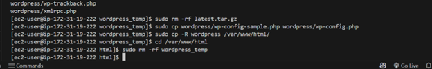
7.  I used the **`fdisk`** utility (instead of `gdisk`) to create a single partition on **each of the 3 disks**.
      * *Note: I used `fdisk` for MBR/DOS partitioning, but if my system required GPT, I would use `gdisk`.*
      * For each disk (e.g., `/dev/nvme1n1`), I created the partition and set the appropriate System ID (e.g., `8e`) for **Linux LVM**.
      * I repeated this for the remaining disks.
8.  I used the `lsblk` utility to view the newly configured partitions. I confirmed that the partition names are **`nvme1n1p1`**, **`nvme2n1p1`**, and **`nvme3n1p1`** (my specific NVMe partitions).

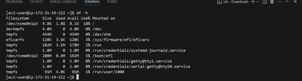

## 3\. Configure Logical Volume Manager (LVM)

9.  I installed the **`lvm2`** package using `sudo yum install lvm2`.
      * *Note: I used the `yum` package manager because I am on a RedHat/CentOS distribution*.
10. After installation, I ran `sudo lvmdiskscan` command to check for available partitions.
11. I used the **`pvcreate`** utility to mark each of the 3 disk partitions as **Physical Volumes (PVs)** to be used by LVM. I used the specific NVMe partition names:
    ```bash
    sudo pvcreate /dev/nvme1n1p1
    sudo pvcreate /dev/nvme2n1p1
    sudo pvcreate /dev/nvme3n1p1
    ```
    

12. I verified that my Physical Volumes have been created successfully by running **`sudo pvs`**. 13. I used the **`vgcreate`** utility to add all 3 PVs to a **Volume Group (VG)**, naming it **`webdata-vg`**.
      * *I used my specific NVMe device names in the command.*
13. I verified that my VG has been created successfully by running **`sudo vgs`**. 15. I used the **`lvcreate`** utility to create 2 logical volumes:
      * **`apps-lv`**: 14 GiB (Use half of the PV size) for website data.
      * **`logs-lv`**: 14 GiB (Use the remaining space of the PV size) for logs.
    <!-- end list -->
    ```bash
    sudo lvcreate -n apps-lv -L 14G webdata-vg
    sudo lvcreate -n logs-lv -L 14G webdata-vg
    ```

14. I verified that my Logical Volumes have been created successfully by running **`sudo lvs`**.

## 4\. Format, Mount, and Data Persistence

17. I used **`mkfs.ext4`** to format the new logical volumes with the **ext4 filesystem**:

    ```bash
    sudo mkfs -t ext4 /dev/webdata-vg/apps-lv
    sudo mkfs -t ext4 /dev/webdata-vg/logs-lv
    ```
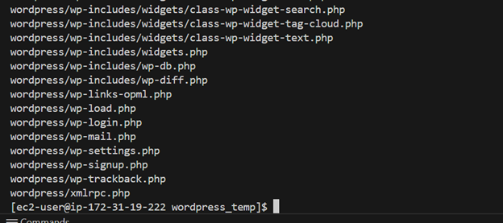
18. I created the necessary directories for mounting the logical volumes:

    ```bash
    # To store website files
    sudo mkdir -p /var/www/html

    # To store backup of log data
    sudo mkdir -p /home/recovery/logs 
    ```
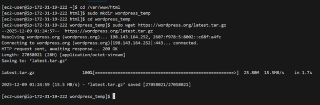
19. I used the **`rsync`** utility to backup all the files in the log directory `/var/log` into `/home/recovery/logs`. This is required *before* mounting the file system.

    ```bash
    sudo rsync -av /var/log/ /home/recovery/logs/
    ```

20. I mounted `/var/www/html` on the **`apps-lv`** logical volume:

    ```bash
    sudo mount /dev/webdata-vg/apps-lv /var/www/html/
    ```

21. I mounted `/var/log` on the **`logs-lv`** logical volume.

    ```bash
    sudo mount /dev/webdata-vg/logs-lv /var/log
    ```

22. I restored the log files back into the now-mounted `/var/log` directory:

    ```bash
    sudo rsync -av /home/recovery/logs/ /var/log
    ```

23. I verified the entire setup by running `sudo vgdisplay -v` and `sudo lsblk`. 24. I updated the **/etc/fstab** file so that the mount configuration will persist after a server restart.

      * I ran `sudo blkid` to find the **UUID** of my devices.     \* I used `sudo vi /etc/fstab` to update the file.
      * I added the UUIDs for my logical volumes:

    <!-- end list -->

    ```bash
    # MOUNTS FOR WORDPRESS WEBSERVER
    UUID="<UUID_OF_APPS-LV>" /var/www/html ext4 defaults 0 0
    UUID="<UUID_OF_LOGS-LV>" /var/log ext4 defaults 0 0
    ```

24. I tested the configuration and reloaded the daemon to ensure the mounts are correct without a reboot:

    ```bash
    sudo mount -a
    sudo systemctl daemon-reload
    ```

25. Finally, I verified my setup by running `df -h` to confirm the new mount points and sizes.

-----

I have now successfully prepared the Web Server with Logical Volume Management and configured persistent mounts.


# ⚙️ Step 3 — Install WordPress on your Web Server EC2

Having completed the storage setup and basic configuration on both the Web Server and DB Server, I will now focus on installing the core WordPress components on the Web Server.

## 1\. Update Repository and Install Dependencies

1.  I updated the repository:

    ```bash
    sudo yum -y update
    ```

2.  I installed `wget`, Apache (`httpd`), and the required PHP packages and dependencies. I included `php-mysqlnd`, `php-fpm`, and `php-json` for modern WordPress compatibility and performance.

    ```bash
    sudo yum -y install wget httpd php php-mysqlnd php-fpm php-json
    ```


## 2\. Start Apache

3.  I enabled the Apache (HTTPD) service to run on boot and then started it:

    ```bash
    sudo systemctl enable httpd
    sudo systemctl start httpd
    ```

## 3\. Install PHP and Dependencies

4.  To ensure I have the desired PHP version and all necessary dependencies, I installed the EPEL and Remi repositories, which are common sources for updated packages on RedHat-based systems:

    ```bash
    sudo yum install https://dl.fedoraproject.org/pub/epel/epel-release-latest-8.noarch.rpm
    sudo yum install yum-utils http://rpms.remirepo.net/enterprise/remi-release-8.rpm
    ```
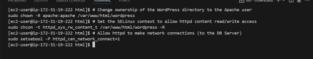
5.  I listed the available PHP modules and reset the default PHP module to enable the desired version (in this case, `remi-7.4`):


    ```bash
    sudo yum module list php
    sudo yum module reset php
    sudo yum module enable php:remi-7.4
    ```

6.  I installed the remaining critical PHP extensions needed for WordPress and database communication, including the PHP FastCGI Process Manager (`php-fpm`):

    ```bash
    sudo yum install php php-opcache php-gd php-curl php-mysqlnd
    ```
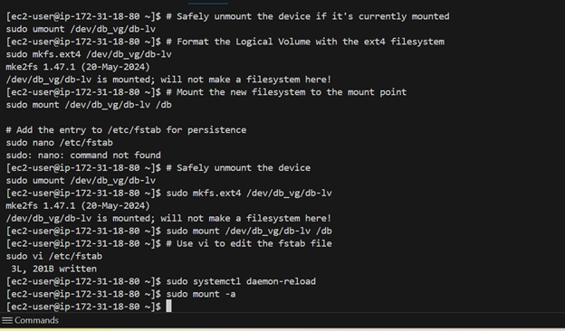
7.  I started and enabled the `php-fpm` service:

    ```bash
    sudo systemctl start php-fpm
    sudo systemctl enable php-fpm
    ```
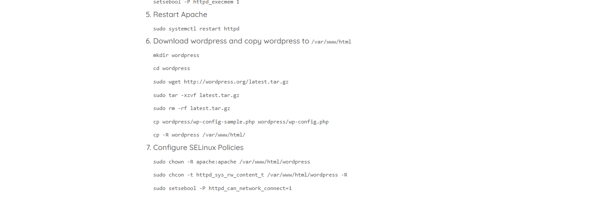
8.  I used the `setsebool` command to configure SELinux to allow Apache to run PHP code via the FastCGI Process Manager:

    ```bash
    setsebool -P httpd_execmem 1
    ```

## 4\. Restart Apache

9.  I restarted the Apache service to ensure all new configurations, including the activated PHP modules and SELinux changes, were loaded:

    ```bash
    sudo systemctl restart httpd
    ```

-----
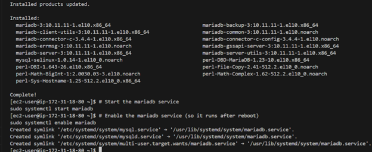
I have now completed the installation and configuration of the web server software. 


# ⚙️ Step 3 (Continued) — Install WordPress on your Web Server EC2

Having installed the necessary web server and PHP dependencies, I proceeded with the following steps to configure the WordPress application.

## 6\. Download WordPress and Copy to /var/www/html


1.  I created a temporary directory named `wordpress` and navigated into it:

    ```bash
    mkdir wordpress
    cd wordpress
    ```

2.  I used `wget` to download the latest stable version of WordPress:

    ```bash
    sudo wget http://wordpress.org/latest.tar.gz
    ```

3.  I extracted the contents of the archive using `tar`:

    ```bash
    sudo tar -xzf latest.tar.gz
    ```

4.  I removed the original `.tar.gz` archive to clean up the directory:

    ```bash
    sudo rm -rf latest.tar.gz
    ```

5.  I copied the sample configuration file to the active configuration file:

    ```bash
    cp wordpress/wp-config-sample.php wordpress/wp-config.php
    ```

6.  I moved the entire `wordpress` directory, which contains the configured files, into my designated web content root:

    ```bash
    cp -R wordpress /var/www/html/
    ```

## 7\. Configure SELinux Policies

To ensure the web server (Apache) can properly read and write files within the `/var/www/html/wordpress` directory, I adjusted file ownership and SELinux contexts.


1.  I changed the ownership of the WordPress directory to the `apache` user and group:

    ```bash
    sudo chown -R apache:apache /var/www/html/wordpress
    ```
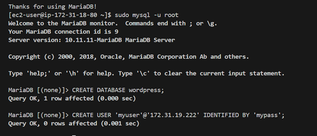
2.  I set the security context for the directory to `httpd_sys_rw_content_t` to allow read/write access for the web server:

    ```bash
    sudo chcon -R -t httpd_sys_rw_content_t /var/www/html/wordpress
    ```
    

3.  Finally, I configured the SELinux boolean `httpd_can_network_connect` to allow the Apache web server process to initiate outbound network connections. This is essential for WordPress to connect to the separate Database Server:

    ```bash
    sudo setsebool -P httpd_can_network_connect=1
    ```

-----

The Web Server configuration is now complete, including the installation of all dependencies, the downloading and placement of WordPress files, and the necessary SELinux security policy adjustments.


# 🌐 Step 6 — Configure WordPress via Web Interface

Having prepared both the Web Server and the Database Server, the final step is to complete the 5-minute installation process through the WordPress web interface.

1.  **Access the Installation URL:** I opened a web browser and navigated to the **Public IP address** of my **Web Server** followed by the `/wordpress` directory:

    `http://<Web-Server-Public-IP-Address>/wordpress`
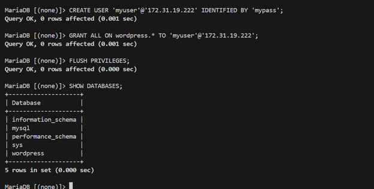
2.  **Language Selection:** The first screen presented the language selection. I chose my preferred language and clicked **Continue**.


3.  **Information Screen:** The next screen confirmed the information needed (Database Name, User, Password, and Host). I clicked **Let's go!**

4.  **Database Details:** The installation page required me to input the database details that I previously configured in the `wp-config.php` file and the MySQL server (Step 5):

    * **Database Name:** `wordpress`
    * **Username:** `myuser`
    * **Password:** `mypassword`
    * **Database Host:** The **Private IP address** of my DB Server (e.g., `172.31.xx.xx`).

    After entering the credentials, I clicked **Submit**.
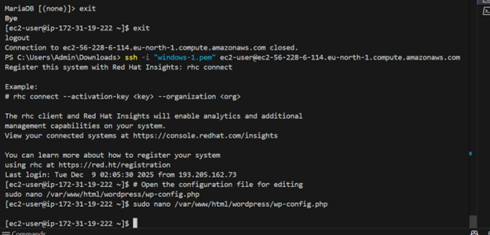
5.  **Installation Run:** The next screen confirmed that WordPress was able to connect to the database. I clicked **Run the installation**.

6.  **Site Information:** I provided the final details for my website:

    * **Site Title:** (e.g., `My WordPress Web Solution`)
    * **Username:** (The admin account for WordPress, e.g., `admin`)
    * **Password:** (A strong password for the admin account)
    * **Your Email:** (My administrative email address)
    * *I left the search engine visibility unchecked to allow indexing.*

7.  **Finalize:** I clicked **Install WordPress**.

8.  **Login:** Upon successful installation, I received the "Success!" confirmation and clicked **Log In**.
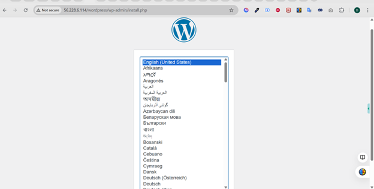
9.  **Verification:** I logged into the WordPress dashboard using the admin credentials I just created. 
***

The WordPress installation is now complete and fully functional, connecting the Web Server and the Database Server.


# 🔒 Step 6 — Configure WordPress to connect to remote database.

This step ensures the Web Server can successfully communicate with the Database Server to run the WordPress application.

> **Hint:** Do not forget to open MySQL port 3306 on the DB Server EC2. For extra security, you shall allow access to the DB server **ONLY** from your Web Server's IP address. In the Inbound Rule configuration, specify the source as `<Web-Server-Private-IP-Address>/32`.

## 1\. Install MySQL Client and Test Connection

1.  I installed the MySQL client on the Web Server EC2 instance:

    ```bash
    sudo yum install mysql
    ```

2.  I tested the connection from the Web Server to the DB Server using the administrative user I created:

    ```bash
    sudo mysql -u myuser -p -h <DB-Server-Private-IP-Address>
    ```
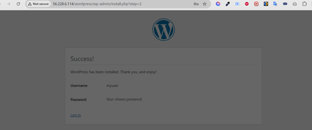
3.  Once connected, I verified the database creation by running:

    ```sql
    SHOW DATABASES;
    ```

    *I confirmed that the `wordpress` database was listed.*

4.  I exited the MySQL client:

    ```sql
    exit
    ```

## 2\. Final Verification and Access Configuration

5.  I changed permissions and configuration so that Apache could successfully run WordPress. (These steps were completed earlier in the SELinux Policies section, including `chown`, `chcon`, and `setsebool httpd_can_network_connect=1`).

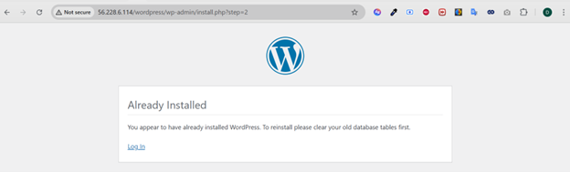

6.  I enabled **TCP port 80** (HTTP) in the Inbound Rules configuration for my **Web Server EC2**. I allowed access from everywhere (`0.0.0.0/0`) or, ideally, just my workstation's IP:

      * *I ensured the Web Server's Security Group had an Inbound rule for Type: HTTP, Protocol: TCP, Port Range: 80, Source: 0.0.0.0/0.*

7.  I accessed the WordPress installation page from my browser using the link:

    `http://<Web-Server-Public-IP-Address>/wordpress/`

    *This launched the final web-based installation where I configured the Site Title, Admin Username, and Password.*

-----
